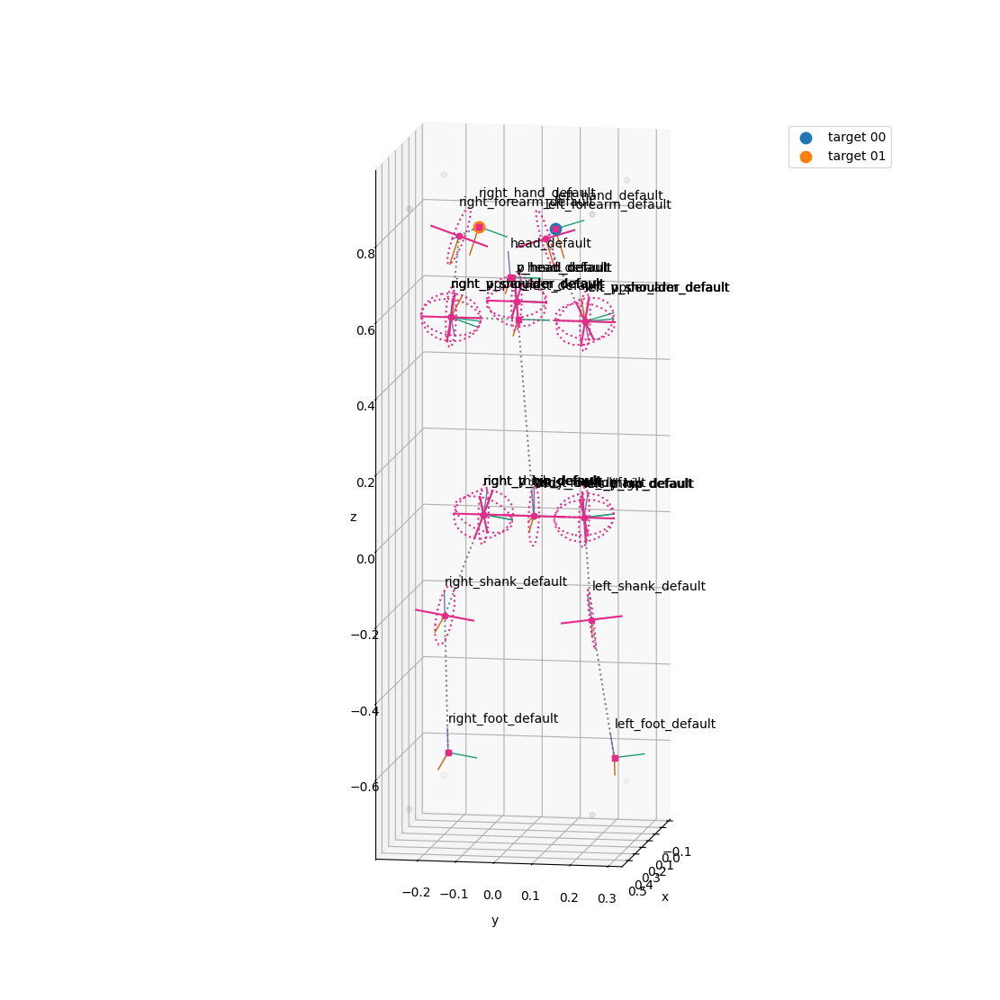

# PyTransform

Python Package to control [transform](https://en.wikipedia.org/wiki/Transformation_matrix) of 3D objects.
The transform are widely used in Game Engines and Robot Simulators.
However, these transforms depend on their platform strongly.
This project aims to develop the independent transform module.
`Transform` class in this project has Unity like methods.

This image is an example of IK solving for human arms.

## Examples
`examples` directory has some example scripts. 
- ik.py: solve ik of a 3-DOF robot manipulator
- ik_dual_arms.py: solve ik of dual arms on a human body
- read_urdf.py: read an urdf file and print its structure

